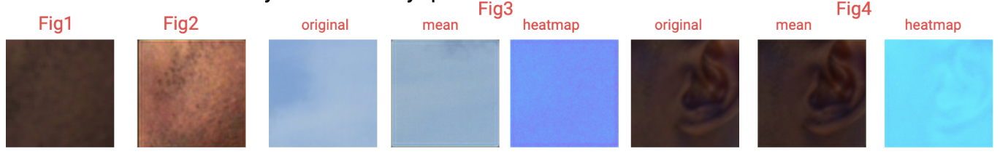

## Abreviations

- LR: Low-Resolution
- HR: High-Resolution

### Uncertainty Quantification:

#### Approach: 
I implemented Monte Carlo Dropout for uncertainty quantification in my model by
running it 40 times per input image during inference with dropout enabled and taking their mean prediction. Mean prediction is a more stable and reliable output than a prediction from a singular pass. Additionally, I measured uncertainty by calculating the pixel-wise standard deviation of these multiple predictions to discern the model's confidence level at each pixel. A higher standard deviation at a pixel implies that the model is less certain about the prediction at that spot, and vice versa. For the resulting heatmap, my approach was to average the standard deviation across the 3 color channels. Averaging across color channels here is sufficient for my general purposes as it broadly considers the image as a whole and is consistent with the human perception of image quality.

#### Discussion: 
I chose Monte Carlo Dropout because of its ability to approximate Bayesian inference, and it’s computationally efficient and can easily be integrated into existing network architecture. However, I experienced the typical drawbacks of using Monte Carlo Dropout, which is the heavy dependence on dropout layers setups. I used two dropout layers and experimented with uniform 0.25, 0.16 ,0.12, 0.07,and 0.04 drop out rates before being able to stabilize my model enough at 0.07 and 0.04. These dropout rates are conservative, but my model risks underfitting with any higher dropout rate. This issue is likely caused by the small size of my dataset combined with the simplicity of the model architecture, where a high dropout rate could lead to excessive loss of information during training, as too many neurons are dropped, limiting the network's ability to learn effectively from the limited data.

### Quantitative Performance/Discussion: 
My model's evaluation involved three subsets of LR-HR image pairs from DIV2K, Set5, Set14, BSD100 datasets. The LR images met the bicubic interpolation downsampled x2 criterion and the LR-HR pairs were randomly multi-cropped, consistent with the training setup. For quantitative analysis, I used Peak Signal-to-Noise Ratio (PSNR) and Structural Similarity Index (SSIM), the traditional and standard metrics for assessing image quality (refer to my benchmarking.ipynb and custom_losses.py for examples). My stabilized model achieved PSNR values ranging from ~18-36, with averages of 26.40, 23.74, 25.25, and SSIM averages of 0.86, 0.806, 0.843. The SSIM values suggest an acceptable level of similarity between predicted and target images, while the lower-than-ideal PSNR indicates potential compromises in image reconstruction quality. However, I anticipated this PSNR decrease because I altered my model with a perceptual loss function and dropout layers. Notably, the perceptual loss function prioritizes high-level features like style and texture over pixel-wise accuracy. Even though PSNR decreased, high-level details, especially textures, were predicted well. Therefore, in super-resolution tasks, it's crucial to balance quantitative metrics with qualitative image examination. These metrics demonstrate substantial model performance; though not the peak achievable values, they signify the important stabilization in model performance post my integration of dropout layers for uncertainty quantification.

### Qualitative Performance/Discussion: 
My model performs well in predicting dense textures, especially if they cover a large area of the image, but has limitations in predicting uniform and single colored areas. In the ‘Images’ folder, I’ve included sample inputs to my model that give a representative survey of predictions that my model does well and falls short on. Inputting ‘runners_in_woods.png’ , ‘flowers_in_bloom.png’, or ‘cityscape.png’, you’ll see that my model correctly predicts complicated dense textures such as leaves, flowers, and buildings. Inputting ‘army_men.png’ or ‘lake_skyline.png’, you’ll see my model’s weakness with uniform color. Consider patches of skin in ‘army_men.png’. The left (fig1) is the original LR image where freckles and skin texture are hard to see, and the right (fig2) is the enhanced predicted image where you can easily see the freckles and texture. This is an example where uniform color may not be accurately predicted, but the texture and style are nonetheless very well captured. Also,the heatmaps overall accurately reflect the uncertainty in predictions (fig3,4). I’m using Python’s ‘cool’ color map; the more neon/bright blue corresponds to higher certainty (fig4) and the more purple corresponds to the lower certainty(fig3). However, I’ve observed some cases where the model is overconfident in terms of discrepancy between the prediction and corresponding heatmap. This might be due to my conservative choice of dropout rate of 0.04, which could reduce prediction variability, leading to a narrower spread in the uncertainty distribution and potential overconfidence. I used a lower dropout rate to get better results during validation, but time permitting, work should definitely focus on empirically testing to balance the model's confidence and accuracy in uncertainty quantification.

### Discussions:
#### Model Architecture: 
Enhanced Super-Resolution Convolutional Neural Network (ESRCNN),
modified with two dropout layers for uncertainty quantification.

#### Loss Function and Nonlinearity: 
My model initially used mean square loss, which struggled to preserve detailed textures like carpets or rocks. I switched to a perceptual loss function because mean squared loss is a pixel-wise loss approach, which can fail to capture high-level details, but perceptual loss focuses on perceptual quality so it is more robust for capturing high level details missed at the pixel level. A perceptual loss function compares high-level features of predicted and target images extracted by a pre-trained CNN. Initially, I utilized VGG19 for its depth, but its computational demand led me to switch to the lighter VGG16 and use its shallower layers. This change significantly lowered computational demands while maintaining accurate high-level detail capture. Perceptual loss function is inherently nonlinear due to the CNN architecture with nonlinear activation functions transforming the layers from which our features are extracted. Introducing perceptual loss function and nonlinearity into the model was crucial for improving its ability to accurately capture the more complicated, hierarchical patterns in the images.
#### Validating bounds:
In the initial stages of validating my model, I observed a skew in the PSNR values, predominantly due to extremely dark or light image patches. These outliers, typically all-dark or all-light backgrounds, adversely affected the model's performance. To address this, images comprising more than 55% of a single color were excluded from the training set, targeting those with excessive uniform backgrounds. My threshold may seem relaxed but it was fine adjusted to handle my particular training data. Even at 55%, only about 10-12 images were removed. While this thresholding approach initially seemed promising and improved validation performance, it may have inadvertently contributed to the already noted inference issue: the model struggles with uniformly colored patches. The limited size of my training dataset, both with and without these images, might have restricted color diversity.
#### Final thoughts:
I think it would be interesting and worthwhile to integrate some type of popular hybrid loss function, combining perceptual loss with mean squared loss, to address my model’s current limitations. While the model performs well in texture prediction, its performance in color accuracy can be improved. The perceptual loss will continue to enhance textural details, while mean squared loss will aid in improving color fidelity by focusing on pixel-level accuracy. Provided the training dataset is larger and more diverse, adjusting my simple ESRCNN model or shifting to a more advanced architecture like EDSR may also be beneficial as it depth may allow for better use of a hybrid loss function.